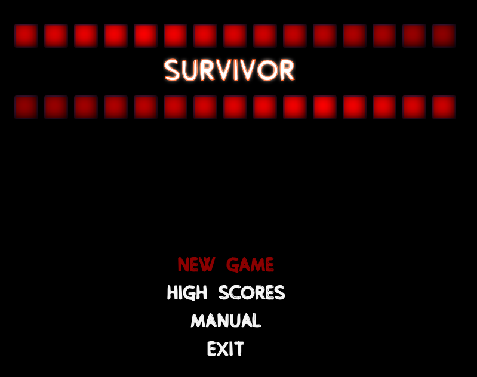

# SURVIVOR

JAVA | JavaFX | FXGL

Alone against hordes of zombies...

## Run from terminal

``./gradlew build --refresh-dependencies``

``./gradlew run``

## Run from IntelliJ

"*View*" -> "*Tool Windows*" -> "*Gradle*" -> double-click option "*run*" as shown below:

## Main Menu Layout

https://user-images.githubusercontent.com/44274979/114444941-bdd01b80-9bcf-11eb-9cde-5a888ac82ea7.mp4
