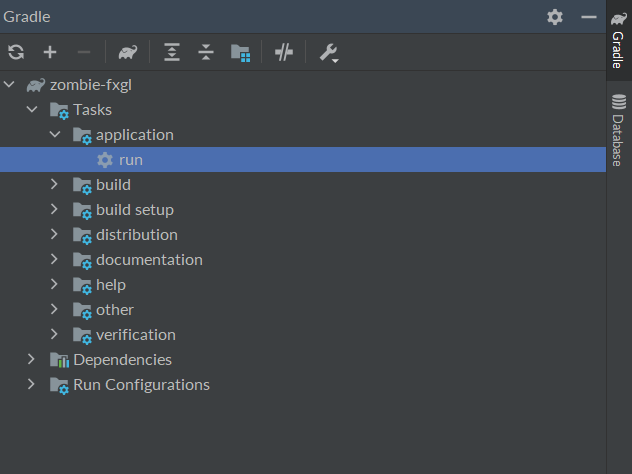
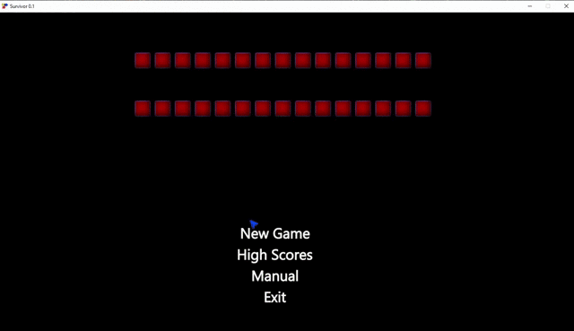

# SURVIVOR

JAVA | JavaFX | FXGL

Alone against hordes of zombies...

## Run from terminal

``./gradlew build --refresh-dependencies``

``./gradlew run``

## Run from IntelliJ

"*View*" -> "*Tool Windows*" -> "*Gradle*" -> double-click option "*run*" as shown below:

## Main Menu Layout

## Short Gameplay Footage

